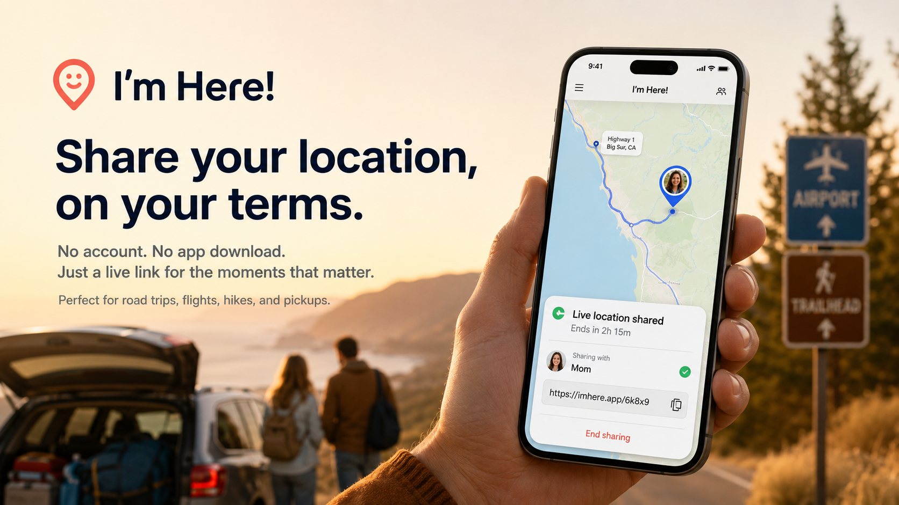

# Where I Am

**Repo:** https://github.com/jkh2/Im-here
**Live demo:** https://jkh2.github.io/Im-here/ (find-someone page — open `share.html` from the same repo to try sending a share)

A live location share for the moments you want someone to be able to find you — a road trip, a flight, a hike, picking up a kid from an event. No account, no app download, no ongoing tracking relationship. You share for a set window of time, on your terms, and then it's over.

## The idea

Turn it on before you go, share a short code with whoever you want to be able to find you, and turn it off when you're there. That's the whole product.

- **You control how long it lasts.** Pick anywhere from 15 minutes to 48 hours when you start. It stops automatically when the timer runs out, or the moment you tap "Stop sharing" — whichever comes first.
- **You control who can see you.** There's no public directory or search. The code is the only way in. Nobody can browse for people using this app; they can only look up a code they were personally given.
- **It doesn't linger.** Once a share ends, the location itself is gone — not just hidden from view. Reopening an expired link shows "this share has ended," nothing more.

## How it works

**If you're sharing your location:**
1. Open `share.html`.
2. Pick how long to share (15 min – 48 hr) and how often to check in (1 min – 1 hr — more frequent drains your battery faster, less frequent is easier on it).
3. Optionally add a short note, like "Driving to Denver."
4. Tap "Start sharing." You'll get an 8-character code and a direct link — text either one to whoever you want to find you.
5. Tap "Stop sharing" any time you're done early.

**If you're looking for someone:**
1. Open the link they sent you, or open `index.html` and type in the code they gave you.
2. You'll see their current location on a map, their trip note if they added one, how long ago they last checked in, and when the share is set to expire.
3. The map updates on its own as they check in — no refreshing needed.
4. Once the share ends, the same link just shows that it's over.

No sign-up on either end. Works the same in any browser, on any phone.

## Why the location isn't blurred

Since a location only ever shows up for someone who was deliberately handed the code, there's no need to fuzz or approximate it — you're already choosing exactly who gets to see it. What you're sharing is genuinely your exact position, for exactly as long as you decide.

## Battery behavior

Your location isn't tracked continuously in the background. Each check-in takes a single fresh GPS reading at the interval you chose, then goes back to sleep — a 1-hour interval really does only touch your phone's GPS once an hour, not continuously with the results just sent less often. You can change the interval mid-share without restarting anything.

## License

Source-available under MIT + Commons Clause — free to use, read, modify, and share, but selling it or building a paid product/service around it requires a separate agreement with the author first. See `LICENSE` for the full terms and contact info.

## Under the hood

Two static pages — `share.html` and `index.html` — backed by a small Supabase project. No server to run, no build step; push both files to any static host (GitHub Pages, Netlify, wherever) with `index.html` at the root so it's what people land on by default.

**Security model:** the database table behind this has no public read or write access at all. Every action — starting a share, checking in, ending a share, or looking one up — goes through a dedicated database function that requires the exact code. There's no way to list, scan, or browse every active share; the code isn't just a suggestion, it's the actual access control. Live updates travel over a private channel named after the code, so even the "live" part of live-tracking is only reachable by someone who already has it.

**Data lifecycle:** the timer is fixed the moment a share starts and doesn't reset on further check-ins. The moment a share expires or is manually ended, location lookups stop returning coordinates — not just visually marked as stale, but actually withheld. Records stick around for 48 hours after the last update (so a just-expired link can still say "this share has ended" instead of erroring out), then age out for good.

**Schema** — a single `shares` table:

| column | type |
|---|---|
| code | text, primary key |
| lat / lng | double precision |
| label | text, optional |
| status | text (`active` / `ended`) |
| expires_at | timestamptz |
| updated_at / created_at | timestamptz |
